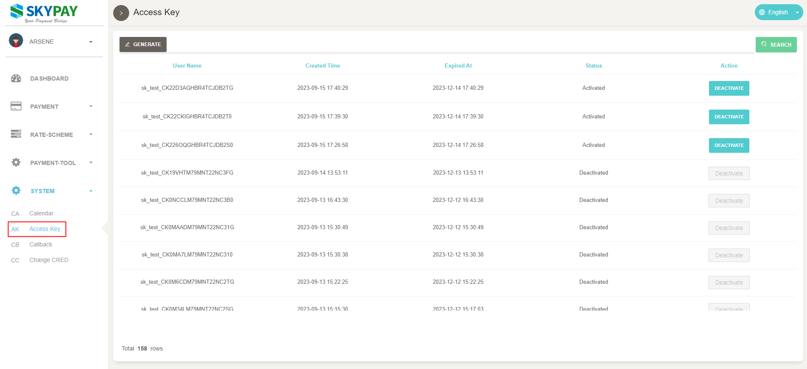
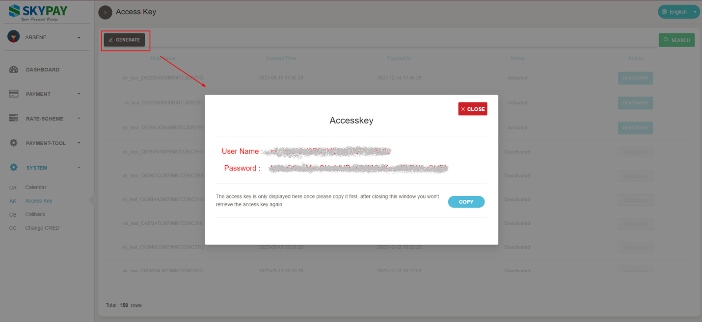

# 7.生成认证金钥

## SkyPay 提供最多5组认证金钥供合作伙伴弹性使用，以下说明金钥生成方式。
### 登入SkyPay后台系统，进入菜单SYSTEM\Access Key功能页面，于页面列示「启用」与「停用」之认证金钥信息。
### 注意：每个金钥有效期限自生成时间计算90天。

### 点击生成按钮后弹窗将显示username & password，此为接口认证使用，请务必复制此组帐密于弹窗中，关闭弹窗后将无法再次取得。
