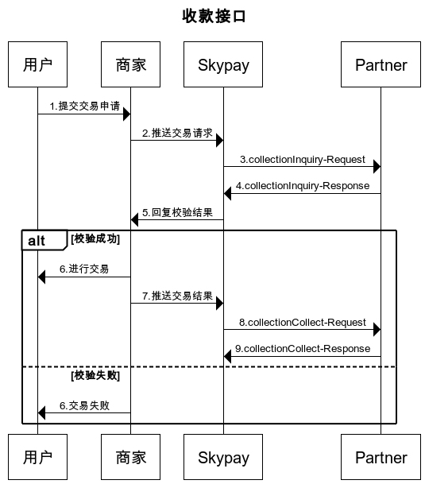

# 5.3 收款数据验证（CollectionInquiry）（同步）
### API由合作伙伴提供，顾客在申请还款时将触发API。

### collectionInquiry验证收款信息
- (1)CollectionInquiry是用来验证这笔支付信息是否存在
- (2)collectionInquiry是在取现人去线下店要求收款时实时发生
- (3)取现人需要提供收款码及必要身分验证信息,透过出纳人员或便利商店自动收款机,进行收款验证
- (4)collectionInquiry功能触发点在线下店出纳人员或取现人透过便利商店Kiosk收款机,点选发送collectionInquiry功能要求时,会发送要到SkyPay

### collectionCollect回复收款成功信息
- (1)collectionCollect是线下店用来回复已确认完成收款交易时使用
- (2)当出纳人员完成确认后,会实时回传collectionCollect讯息
- (3)功能触发点,在出纳人员,点选collectionCollect,回复收款成功信息给SkyPay服务器

### Input parameters
| 参数                        |    类型     | 长度   |Y/N |描述|
| :-------------------------: | :-----------: |:-----:|:---:|--------------------------------|   
|userName|string|50|Y|使用者名称   SkyPay提供 - Ex:"userName":"AppName@skypay"|
|action|string|50|Y|调用行为 collectionInquiry(固定参数值) - Ex:"action":"collectionInquiry"|
|authentication |string |255|Y|验证密钥 Ex:"authentication":"E1234567-123C-1234-123F-A12345670"|
|controlNumber|string|13~15|Y|取款码  前缀码5码+8~10个数字（前缀码在绑定邮箱中获取） - Ex:SKY**12345678|
|amount|string|10.20|Y|支付金额支持数字小数位两位   ex:"amount":3400.00|
|phone|string|11|Y|09/08开头的11位数字   Ex:"phone":"09270348095"|

### Post data

{ 
    &ensp;&ensp;&ensp;&ensp;"userName" : "AppName@skypay", 
    &ensp;&ensp;&ensp;&ensp;"action" : "collectionIcnquiry", 
    &ensp;&ensp;&ensp;&ensp;"authentication" : "30AC21B2-9EAA-4503-B0F0-7BE5C277ED75", 
    &ensp;&ensp;&ensp;&ensp;"controlNumber" : "SKY0XXXXXXXXXX", 
    &ensp;&ensp;&ensp;&ensp;"amount" : "3900.00", 
    &ensp;&ensp;&ensp;&ensp;"phone" : "6392210083333" 
}

### Output parameters
| 参数                        |    类型     | 长度  |Y/N  |描述|
| :-------------------------: | :-----------: |:-----:|:-----:|--------------------------------|   
|responseTime|DateTime|50|Y|回传时间  yyyy-MM-dd HH:mm:ss.SSSS|
|responseCode|int|4|Y|系统默认回传码,长度为4的数字,标准参考回码定义,系统默认回传码不足时,使用者可自定义代码,请以数字2开头,长度为4的数字,并明确在回传内容|
|responseDescription|string|255| Y|回传内容描述   响应信息|
|amount|decimal|10.20|Y|收款金额   支付金额只能为数字小数位两位监管要求需要还款信息留存档案|
|payerName|string|255|Y|还款人名字   使用逗号分割。Last name+","+First name+","+Middle name+","+Suffix监管要求需要还款信息留存档案|
|payer添加ress|string|255|Y|还款人地址 监管要求需要还款信息留存档案|
|payerPhone|string|11|Y|还款人电话  09/08开头11位数字 监管要求需要还款信息留存档案|

### Output data

{ 
    &ensp;&ensp;&ensp;&ensp;"responseTime" : "2018-06-18 17:52:10.5211", 
    &ensp;&ensp;&ensp;&ensp;"responseCode" : "1000", 
    &ensp;&ensp;&ensp;&ensp;"responseDescription" : "Success", 
    &ensp;&ensp;&ensp;&ensp;"amount" : "3900.00", 
    &ensp;&ensp;&ensp;&ensp;"payerName" : "Last name,First name,Middle name", 
    &ensp;&ensp;&ensp;&ensp;"payer添加ress" : "1740 Mabini St,Malate,Manila,1004 Metro Manila,Phi-lip-pin", 
    &ensp;&ensp;&ensp;&ensp;"payerPhone" : "092210083333" 
}

### Return code:

| 状态代码                        |   状态描述    | 
| :-------------------------: | :----------- |
|1000 |Success|
|-1001|Verification error|
|-1009|Unpredictable exception occurs|
|-1015|The contract number is invalid.|
|-1026|Transactions has been paid|

