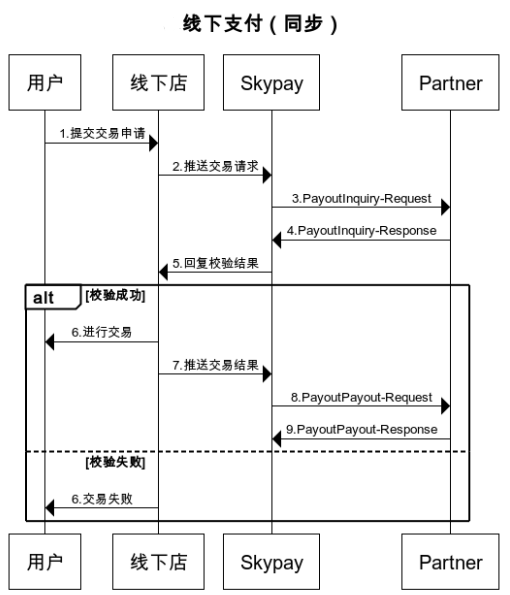

# 4.1 线下支付数据验证（PayoutInquiry）
**这个支付验证的API服务,是由合作伙伴提供,它将会在取现人要求提款时,发出要求验证讯息**

### Input parameters
| 参数                        |    类型     | 长度   |Y/N |描述|
| :-------------------------: | :-----------: |:-----:|:----:|--------------------------------|   
|userName |string|50|Y|用户名称，SkyPay提供 - Ex:"userName":"AppName@skypay"|
|action|string|50|Y|payoutInquiry(固定参数值) - Ex:"action":"payoutInquiry"|
|authentication   |string |100|Y|验证码 - 验证密钥 - Ex:"authentication":"E1234567-123C-1234-123F-A12345670"|
|controlNumber |string|13~15|Y| 取款码 - 前缀码5码+8~10个数字（前缀码在绑定邮箱中获取） - Ex:SKY**12345678|
### Post data

{ 
    &ensp;&ensp;"userName" : "AppName@skypay", 
    &ensp;&ensp;"action" : "payoutInquiry", 
    &ensp;&ensp;"authentication" : "30AC21B2-9EAA-4503-B0F0-7BE5C277ED75", 
    &ensp;&ensp;"controlNumber" : "SKY0XXXXXXXXXX" 
}

### Output parameters
| 参数                        |    类型     | 长度   | Y/N|描述|
| :-------------------------: | :-----------: |:-----:| :--:|--------------------------------|   
|responseTime  |DateTime|26|Y |回应时间 -  yyyy-MM-dd HH:mm:ss.SSSS|
|responseCode  |int|4|Y |回应代码 - 4系统默认回传码,长度为4的数字,标准参考回传码定义,|
|responseDescription  |string|255||回应描叙内容 - 响应信息|
|sender  |string|255|Y|汇款人 - 产品APP名称(必填：由合作伙伴设计) - Ex:"sender":"APP NAME"|
|sender添加ress|string|255|Y |汇款人地址|
|name |string |50| Y|取现人名字  - 使用逗号分割  - Last name+","+First name+","+Middle name+","+Suffix - Ex:"name":"Lardizabal,Mary Annalou B.Lardizabal,Berja,|
|birthday |Date|10|Y |生日格式：yyyy-MM-dd - Ex:"birthday":"1991-10-02" -  写入此字段，参数需要填入正确格式|
|identificationId  |string|50|Y|身份证件号码- 依不同身份验证方式,持有证件编号 - Ex:"identificationId":"442301922000"|
|idType  |string|50| |验证身份证件类别 - 身份证类型（SSS、UMID、驾驶执照、TIN…）“idType”：“TIN”（必填）|
|phone |string|11| Y |09开头的11位数字(必填)  - Ex:"phone":"09270348095"|
|amount |string|10.20| Y |金额 - 支付金额支持数字小数位两位(必填) -  ex:"amount":3400.00|
|idcardPicType |string|50| Y|相片文件格式 - 文件格式之附属档名(必填) - Ex:"idcardPicType":"jpg"|
|idcardPicUrl |string |500|Y|相片存取网络地址 - Ex:"idcardPicUrl":"https://12334"|
|contractNumber  |string|15|N|收款码 - 前缀码5码+8~10个数字（前缀码在绑定邮箱中获取） - Ex:SKY**12345678|
|location  |string |100| Y|地址 - 添加ress取现人地址(必填)|

### Output data：

{ 
    &ensp;&ensp;"responseTime" : "2018-06-18 17:52:10.5211", 
    &ensp;&ensp;"responseCode" : "1000", 
    &ensp;&ensp;"responseDescription" : "Success", 
    &ensp;&ensp;"referenceNo" : "", 
    &ensp;&ensp;"sender" : "Skybridge", 
    &ensp;&ensp;"controlNumber" : "SKYXXXXXXXXXX", 
    &ensp;&ensp;"sender添加ress" : "1740 Mabini St,Malate,Manila,1004 Metro Manila,Phi-lip-pin", 
    &ensp;&ensp;"name" : "Last name,First name,Middle name", 
    &ensp;&ensp;"birthday" : "1945-01-01", 
    &ensp;&ensp;"identificationId" : "123456789011", 
    &ensp;&ensp;"idType" : "SSS", 
    &ensp;&ensp;"phone" : "6392210083333", 
    &ensp;&ensp;"amount" : "3900.00", 
    &ensp;&ensp;"idcardPicType" : "png", 
    &ensp;&ensp;"idcardPicUrl" : "http://skybridge.com.tw/sample.png", 
    &ensp;&ensp;"contractNumber" : "SK00000000001", 
    &ensp;&ensp;"location" : "1740 Mabini St,Malate,Manila,1004 Metro Manila,Phi-lip-pin" 
}

### Return code:

| 状态代码                        |   状态描述    | 
| :-------------------------: | :----------- |
|1000 |Success|
|-1001|Verification error|
|-1009|Unpredictable exception occurs|
|-1012|Control number invalid or expired|
|-1014|Prefix of Control number is incorrect.|
|-1016|Insufficient balance|
|-1022|Invalid Accountnumber|
|-1026|Transactions has been paid|

