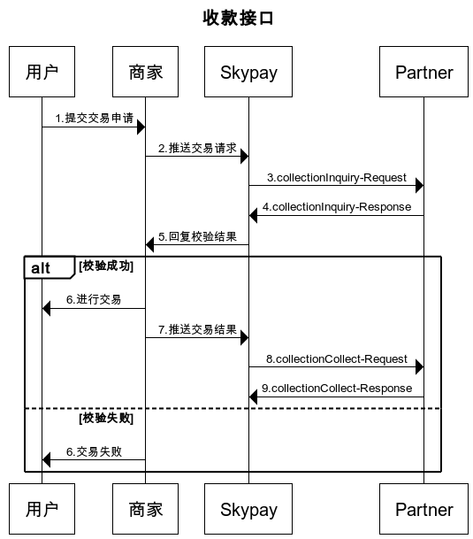

# 支付处理流程-实时交易说明

## 收款-交易顺序图

### payoutInquiry取款验证信息
- (1)当取现人要求线下店进行取款要求时,payoutInquire将会实时被叫用,进行支付信息验证工作
-  (2)payoutInquire被叫用后,会回传合作伙伴验证结果,线下店将会收到详细的支付信息以及用户信息
- (3)取现人需要提供取款码及必要的身分验证信息如给出纳人员
- (4)出纳人员在检查取款码及身分验证信息后,会系统回复人工验证是否成功讯息,并传送到Skypay服务器

###  payoutPayout回复支付成功信息
- (1)payoutInquiry成功后,payoutPayout将会由线下店进行叫用,回传这笔交易己支付成功的讯息
- (2)这个交易会在出纳确认该支付,已完成支付动作时发生
- (3)这个功能的实际触发点在出纳人员按下payoutPayout功能按钮时(人工操作)
### collectionInquiry验证收款信息
- (1)CollectionInquiry是用来验证这笔支付信息是否存在
- (2)collectionInquiry是在取现人去线下店要求收款时实时发生
- (3)取现人需要提供收款码及必要身分验证信息,透过出纳人员或便利商店自动收款机,进行收款验证
- (4)collectionInquiry功能触发点在线下店出纳人员或取现人透过便利商店Kiosk收款机,点选发送collectionInquiry功能要求时,会发送要到SkyPay

### collectionCollect回复收款成功信息
- (1)collectionCollect是线下店用来回复已确认完成收款交易时使用
- (2)当出纳人员完成确认后,会实时回传collectionCollect讯息
- (3)功能触发点,在出纳人员,点选collectionCollect,回复收款成功信息给SkyPay服务器
