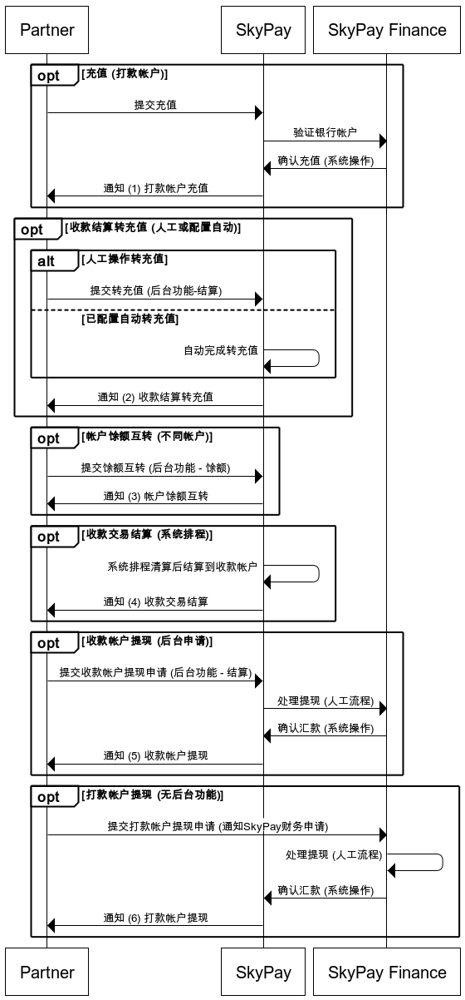

# 5.1通知接口-充值、结算、提现（financeNotification）

### 这支API是由合作伙伴提供,透过下列时机由SKYPAY发动请求，对合作伙伴发送「充值、结算、提现」之入帐通知。
- 充值、结算、提现
    - (1)打款帐户充值-当人工充值并由SKYPAY财务确认入帐系统时
    - (2)收款结算转充值–当收款结算后，将收款帐户资金转充值打款帐户(人工或配置自动)
    - (3)帐户馀额互转–当不同公司帐户打款馀额进行互转时，将同时通知2个帐户
    - (4)收款交易结算-当系统自动结算收款交易，并入帐时
    - (5)收款帐户提现-当收款结算后进行提现(后台功能)，SKYPAY财务确认完成打款时
    - (6)打款帐户提现–由合作伙伴申请从打款帐户提现，SKYPAY财务确认完成打款时
### 充值、结算、提现通知流程

### 回调接口只做通知使用，无论收到任何状态，只可以返回responseCode 1000，代表成功收到通知。
#### Input parameters
| 参数                        |    类型     | 长度    |描述|
| :-------------------------: | :-----------: |:-----:|--------------------------------|   
|userName - 使用者名称|string|50|(必填)用户名称，SkyPay提供 - Ex:"userName":"AppName@skypay"|
|action-调用行为|string|50|(必填)payoutInquiry(固定参数值) - Ex:"action":"payoutInquiry"|
|authentication  - 验证码|string |50|(必填)验证密钥 - Ex:"authentication":"E1234567-123C-1234-123F-A12345670"|
|transctionDate - 通知日期|DateTime|50|ex:2023-06-18 17:52:10|
|companyPrefix - 公司编码|string|5|ex:SKY98|
|companyName - 公司名称|string|200|ex:Skybridge Payment Inc.|
|accountNo - 帐户|string|5|ex:SKY98|
|sourceAccountNo - 资金来源帐号|string|20|来源帐号(实际银行帐号，只在提现时提供)|
|beneficiaryAccountNo - 资金目的帐号|string|20|目的帐号(实际银行帐号，只在充值及提现时提供)|
|sourceAccountNo - 资金来源帐号|string|20|来源帐号(实际银行帐号，只在提现时提供)|
|statementType - 通知类型|string|1|1:打款帐户充值 - 2:收款结算转充值 - 3:帐户馀额互转 - 4:收款交易结算 - 5:收款帐户提现 - 6:打款帐户提现|
|signType - 资金增减类型|string|10|recharge:增项 - reduce:减项|
|Amount - 金額|int||Ex:1200000|
|Currency - 货币|string|3|固定币别PHP|
|referenceNumber交易编号(唯一)|string|15|此编号可于后台查询。- S–开头编号为结算功能(後台)中生成的交易。 - D–开头编号为充值功能(後台)中生成的交易- {callerName}–开头编号为系统自动结算的交易。-ex:S-20231204-001D-20231204-001,skypay-20231204|
#### Post data

<table color=blue><tr><td white=DarkSeaGreen>

{ 
 &ensp;&ensp;&ensp;   "userName"  &ensp;:  &ensp;"AppName@skypay" ,  
  &ensp;&ensp;&ensp;   "action"   &ensp;  :   &ensp; "financeNotification", 
   &ensp;&ensp;&ensp;  "authentication"   &ensp;  :  &ensp; "30AC21B2-9EAA-4503-B0F0-7BE5C277ED75", 
  &ensp;&ensp;&ensp;   "transctionDate"&ensp;: &ensp;"2023-06-18 17:52:10", 
  &ensp;&ensp;&ensp;   "companyPrefix"&ensp;:&ensp;"SKY98", 
  &ensp;&ensp;&ensp;   "companyName"&ensp;:&ensp;"SKYPAY", 
  &ensp;&ensp;&ensp;   "accountNo"&ensp;:&ensp;"091234567899", 
  &ensp;&ensp;&ensp;   "sourceAccountNo"&ensp;:&ensp;"", 
  &ensp;&ensp;&ensp;   "beneficiaryAccountNo"&ensp;:&ensp;"001234567899", 
 &ensp;&ensp;&ensp;"statementType"&ensp;:&ensp;"1", 
  &ensp;&ensp;&ensp;   "signType"&ensp;:&ensp;"recharge", 
   &ensp;&ensp;&ensp;  "amount"&ensp;:&ensp;12000000, 
   &ensp;&ensp;&ensp;  "currency"&ensp;:&ensp;"PHP", 
  &ensp;&ensp;&ensp;   "referenceNumber"&ensp;:&ensp;"D-20231204-001" 
}
</td></tr></table>

#### Output parameters

| 参数                        |    类型     | 长度    |描述|
| :-------------------------: | :-----------: |:-----:|--------------------------------|   
|responseTime- 回传时间|DateTime|50|yyyy-MM-dd HH:mm:ss.SSSS|
|responseCode - 回传代码|int|4|1000|
|responseDescription - 回传内容描述|string|255|Success|

#### Output data：
<table color=blue><tr><td white=DarkSeaGreen>

{ 
  &ensp;&ensp;&ensp;"responseTime"&ensp;:&ensp;"2018-06-18 17:52:10.5211", 
    &ensp;&ensp;&ensp; "responseCode"&ensp;:&ensp;"1000", 
  &ensp;&ensp;&ensp; "responseDescription"&ensp;:&ensp;"Success", 
}

</td></tr></table>

### Return code
| 状态代码                        |   状态描述    | 
| :-------------------------: | :-----------: |
|1000 |Success|

