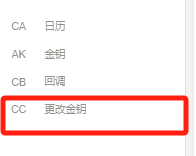
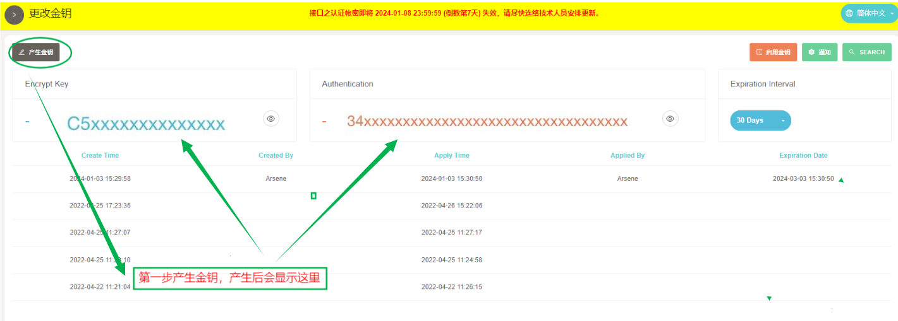
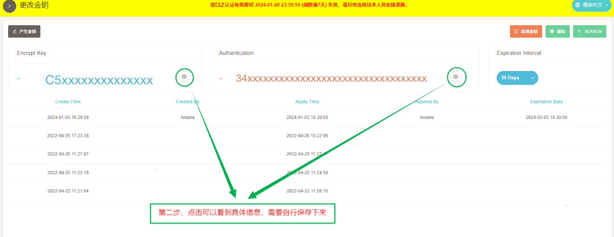
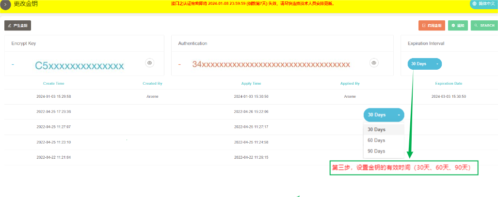
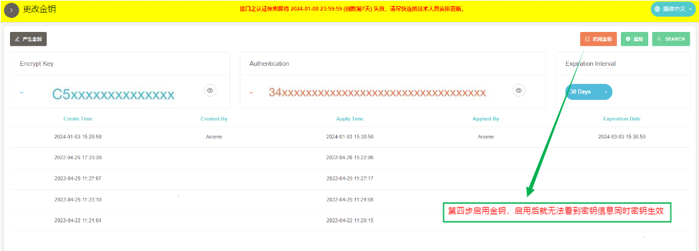
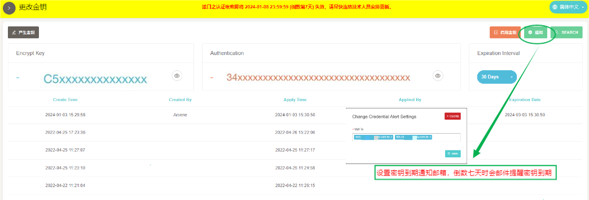
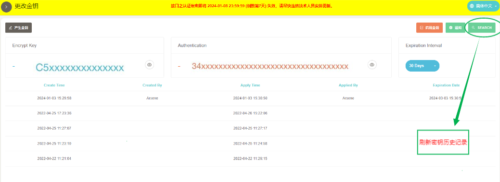

# SKYPAY Key Update Function Guidelines

## 1. Purpose

### &ensp;&ensp;&ensp;&ensp; Based on security principles, we have added an expiration date to the key and provided expiration intervals of 30, 60, and 90 days for you to choose from flexibly. Additionally, a notification email setting function has been added to remind you to update your key when it approaches expiration.

## 2. Operation process

- (1) CC Change Key

- (2) Generate key

 - The first step is to generate the key, which will be displayed on the page in an encrypted manner after generation

- (3) View the key and record it

 - The second step is to click the button to display the original text, and you need to record it yourself.

 - (4) Set key expiration date

 - The third step is to set the key period. There are three options: 30 days, 60 days, and 90 days, which can be selected as needed.

 - (5) Enable Key

  - Step 4: Enable the key. Once enabled, the key becomes effective and cannot be viewed.

 - (Please note that due to the Cache mechanism, the key will only take effect after 5 minutes of activation)

 - (6) Set email key expiration reminder

 - This operation is to enable email notification reminder. After filling in the email, the system will send an email notification seven days before the key expires. Please note

 - Update key information. If you do not set an email, please leave it blank. The expiration reminder will be displayed above the background.

 - (7) Refresh Key History

 - This operation is to refresh the key history and update it to the latest generated key record.

 - (Key history record, only records relevant information such as creation and activation time, and does not record enabled keys)

