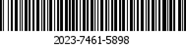

# 4.3.1Generate 7-11 payment barcode（Generate711Barcode）

#### The purpose of this API is to reduce the possibility of filling in incorrect contract number amounts. 

#### Barcode generation has a validity period of 24 hours. The customer needs to generate the referenceNumber in the code returned by the API as a Code128-A barcode in their Apps.  

#### After the withdrawal person transfers to 7-11 for payment, they can display the barcode to the store clerk to process the payment. After the salesperson scans the barcode, the payment process will not change, and it will call the payment query again before further processing.

### Input parameters
| parameter                        |    type     | length   |Y/N |describe|
| :-------------------------: | :-----------: |:-----:|:----:|--------------------------------|   
|userName|string|50|Y|User name - provided by SkyPay - Ex:"userName":"AppName@skypay"|
|action|string|50|Y|generate711Barcode(Fixed parameter values) - Ex:"action":"generate711Barcode"|
|authentication|string |255|Y|Verification Code - Verification Key - Ex:"authentication":"E1234567-123C-1234-123F-A12345670"|
|contractNumber|string|13~15|Y|Payment code - prefix code 5+8-10 digits (prefix code can be obtained from the bound email) - Ex:SKY**12345678|
|name |string |50|Y|Reparer's name - separated by commas。  - Last name+","+First name+","+Middle name+","+Suffix - Ex:"name":"Lardizabal,Mary Annalou B.Lardizabal,Berja,|
|phone |string|50|Y|11 digit number starting with 09 - Ex:"phone":"09270348095"|
|amount |decimal|10.20|Y|Must be the actual amount received by the user, with a maximum of two decimal places -  ex:"amount":3400.00|

### Post data

{ 
    &ensp;&ensp;&ensp;&ensp;"userName" : "AppName@skypay", 
    &ensp;&ensp;&ensp;&ensp;"action" : "generate711Barcode", 
    &ensp;&ensp;&ensp;&ensp;"authentication" : "30AC21B2-9EAA-4503-B0F0-7BE5C277ED75", 
    &ensp;&ensp;&ensp;&ensp;"controlNumber" : "SKY0XXXXXXXXXX", 
    &ensp;&ensp;&ensp;&ensp;"amount" : "3900.00", 
    &ensp;&ensp;&ensp;&ensp;"phone" : "6392210083333", 
    &ensp;&ensp;&ensp;&ensp;"name" : "MyName,This,Is" 
}

### Output parameters
| parameter                        |    type     | length    |describe|
| :-------------------------: | :-----------: |:-----:|--------------------------------|   
|responseTime |DateTime|50|Return time - yyyy-MM-dd HH:mm:ss.SSSS|
|responseCode  |int|4|Return Code - System default return code, a number of 4 in length, standard reference return code definition. When the system default return code is insufficient, users can customize the code. Please start with the number 2, a number of 4 in length, and clearly describe the content of the return|
|responseDescription |string|255| Feedback Content Description - Response Information (Required)|
|referenceNumber|string|50|Generated Code|

### Output data：

{ 
  &ensp;&ensp;&ensp;&ensp;"responseTime" : "2018-06-18 17:52:10.5211", 
  &ensp;&ensp;&ensp;&ensp;"responseCode" : "1000", 
  &ensp;&ensp;&ensp;&ensp;"responseDescription" : "Success", 
  &ensp;&ensp;&ensp;&ensp;"referenceNumber" : "9919-2940-0349" 
}

The Code128-A barcode generated based on the referenceNumber returned by the API is as follows

