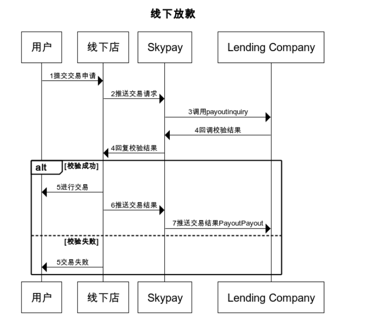

# 5.1 Offline payment data verification（PayoutInquiry）

**This payment verification API service is provided by the partner and will send a verification request message when the withdrawer requests a withdrawal**

### Input parameters

| parameter                        |    type     | length   |Y/N |describe|
| :-------------------------: | :-----------: |:-----:|:----:|--------------------------------|   
|userName |string|50|Y|User name  provided by SkyPay - Ex:"userName":"AppName@skypay"|
|action|string|50|Y|Call behavior payoutInquiry(Fixed parameter values) - Ex:"action":"payoutInquiry"|
|authentication   |string |100|Y|Verification Code   Verification Key - Ex:"authentication":"E1234567-123C-1234-123F-A12345670"|
|controlNumber |string|13~15|Y| Payment code   prefix code 5+8-10 digits (prefix code can be obtained from the bound email) - Ex:SKY**12345678|

### Post data

{ 
    &ensp;&ensp;"userName" : "AppName@skypay", 
    &ensp;&ensp;"action" : "payoutInquiry", 
    &ensp;&ensp;"authentication" : "30AC21B2-9EAA-4503-B0F0-7BE5C277ED75", 
    &ensp;&ensp;"controlNumber" : "SKY0XXXXXXXXXX" 
}

### Output parameters
|              parameter                        |    type     | length   |Y/N |describe|
| :-----------------------------: | :-----------: |:-----:| :--:|--------------------------------|   
|responseTime  |DateTime|26|Y |responsiveness    yyyy-MM-dd HH:mm:ss.SSSS|
|responseCode  |int|4|Y |Response code  4 system default return code, a number of length 4, standard reference return code definition|
|responseDescription  |string|255||Response Description Content   Response Information|
|sender  |string|255|Y|Remitter  Product APP Name (Required: Designed by Partner) - Ex:"sender":"APP NAME"|
|sender increaseress|string|255|Y |Remittance Address|
|name |string |50| Y|Name of withdrawal person   separated by commas  - Last name+","+First name+","+Middle name+","+Suffix - Ex:"name":"Lardizabal,Mary Annalou B.Lardizabal,Berja,|
|birthday |Date|10|Y |Birthday format： yyyy-MM-dd - Ex:"birthday":"1991-10-02" -  To write this field, the parameters need to be filled in the correct format|
|identificationId  |string|50|Y|ID number  Depending on different authentication methods, hold the ID number - Ex:"identificationId":"442301922000"|
|idType  |string|50| |Verify ID Type   ID Type (SSS, UMID, Driver's License, TIN...) "idType": "TIN" (mandatory)|
|phone |string|11| Y |11 digit number starting with 09 (required)   Ex:"phone":"09270348095"|
|amount |string|10.20| Y |Amount  Payment amount supports two decimal places (required) -  ex:"amount":3400.00|
|idcardPicType |string|50| Y|Photo file format  file format attachment file name (required) - Ex:"idcardPicType":"jpg"|
|idcardPicUrl |string |500|Y|Photo access network address  Ex:"idcardPicUrl":"https://12334"|
|contractNumber  |string|15|N|Payment code   prefix code 5+8-10 digits (prefix code can be obtained from the bound email) - Ex:SKY**12345678|
|location  |string |100| Y|Address  Add Address Withdrawal Address (Required)|

### Output data：

{ 
    &ensp;&ensp;"responseTime" : "2018-06-18 17:52:10.5211", 
    &ensp;&ensp;"responseCode" : "1000", 
    &ensp;&ensp;"responseDescription" : "Success", 
    &ensp;&ensp;"referenceNo" : "", 
    &ensp;&ensp;"sender" : "Skybridge", 
    &ensp;&ensp;"controlNumber" : "SKYXXXXXXXXXX", 
    &ensp;&ensp;"sender increase ress" : "1740 Mabini St,Malate,Manila,1004 Metro Manila,Phi-lip-pin", 
    &ensp;&ensp;"name" : "Last name,First name,Middle name", 
    &ensp;&ensp;"birthday" : "1945-01-01", 
    &ensp;&ensp;"identificationId" : "123456789011", 
    &ensp;&ensp;"idType" : "SSS", 
    &ensp;&ensp;"phone" : "6392210083333", 
    &ensp;&ensp;"amount" : "3900.00", 
    &ensp;&ensp;"idcardPicType" : "png", 
    &ensp;&ensp;"idcardPicUrl" : "http://skybridge.com.tw/sample.png", 
    &ensp;&ensp;"contractNumber" : "SK00000000001", 
    &ensp;&ensp;"location" : "1740 Mabini St,Malate,Manila,1004 Metro Manila,Phi-lip-pin" 
}

### Return code:

| Status Code                        |   Status Description    | 
| :-------------------------: | :----------- |
|1000 |Success|
|-1001|Verification error|
|-1009|Unpredictable exception occurs|
|-1012|Control number invalid or expired|
|-1014|Prefix of Control number is incorrect.|
|-1016|Insufficient balance|
|-1022|Invalid Accountnumber|
|-1026|Transactions has been paid|

