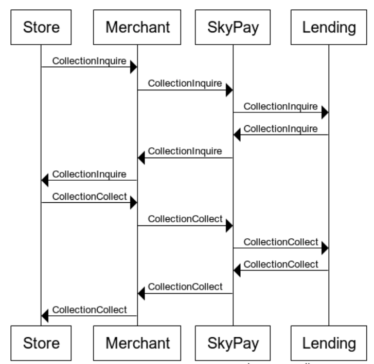

# Payment processing flow - Real time transaction instructions

### payoutInquiryWithdrawal verification information
- (1) When the withdrawal person requests a withdrawal request from an offline store, payoutInquire will be called in real-time to verify payment information

- (2) After being called, payoutInquire will return the verification results to the partners, and offline stores will receive detailed payment information and user information

- (3) The withdrawal person needs to provide the withdrawal code and necessary identity verification information, such as to the cashier

- (4) After checking the withdrawal code and identity verification information, the cashier will receive a manual verification message and send it to the Skypay server

###  payoutPayout回复支付成功信息
- (1) After the payoutInquiry is successful, the payoutPayout will be called by the offline store, and the message that the transaction has been successfully paid will be sent back

- (2) This transaction will occur when the cashier confirms the payment and the payment action has been completed

- (3) The actual triggering point of this function is when the cashier presses the payoutPay function button (manual operation)

### collectionInquiry Verify receipt information

- (1) CollectionInquiry is used to verify whether this payment information exists

- (2) CollectionInquiry occurs in real time when the withdrawal person requests payment at an offline store

- (3) The withdrawal person needs to provide a payment code and necessary identity verification information, and conduct payment verification through the cashier or convenience store's automatic payment machine

- (4) The trigger point for the collectionInquiry function is that when the offline store cashier or cash withdrawal person selects the "send collectionInquiry" function request through the convenience store kiosk, they will send it to SkyPay

### collectionCollect回复收款成功信息
- (1) CollectionCollect is used by offline stores to reply to confirmed completed payment transactions

- (2) After the cashier completes the confirmation, a real-time collectionCollect message will be sent back

- (3) Function trigger point, at the cashier, select collectionCollect and reply with a successful payment message to the SkyPay server
