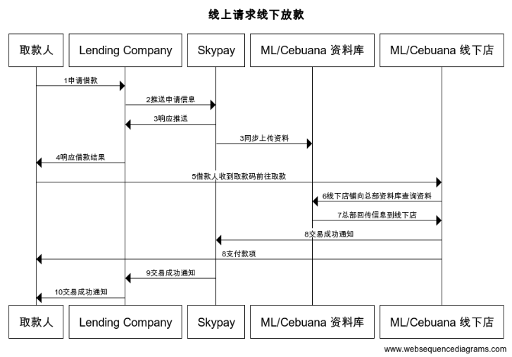

# 4.2 ML/CebuanaOnline request for offline withdrawal（payoutQueueV2）

### This interface is a designated channel payment interface that is actively pushed by partners to SkyPay. It is an asynchronous interface and the payment result is recalled by the 3.2 PayoutQueuePayout interface。

### pay attention to
#### Please note that if this payment interface is selected, it means that this payment is specified to be withdrawn from Cebuana or ML, and other channels will not support withdrawing this payment。
#### You can cancel this payment before the user withdraws it. Please call "3.3 Payout - cancelPayout". Cancellation is not a real-time cancellation. Please reply with the cancellation result the next day and cancel without refunding the service fee。

### Input parameters:
| parameter                        |    type     | length   |Y/N |describe|
| :-------------------------: | :-----------: |:-----:|:----:|--------------------------------|   
|userName|string|50|Y|User Name   Provided by SkyPay - Ex:"userName":"AppName@skypay"|
|action|string|50|Y|Call behavior payoutQueueV2(Fixed parameter values)- Ex:"action":"payoutQueueV2"|
|authentication   |string |50|Y|Verification Code  Verification Key - Ex:"authentication":"E1234567-123C-1234-123F-A12345670"|
|sender  |string|100| Y   |Payer   Product APP Name: Designed by Partner   Ex:"sender":"APP NAME"|
|controlNumber  |string|13~15|Y|Withdrawal code   Prefix code 5+8-10 digits (Prefix code can be obtained from the bound email) - Ex:SKY**12345678|
|name |string |50|Y|Name of withdrawal person  separated by commas。  - Last name+","+First name+","+Middle name+","+Suffix - Ex:"name":"Lardizabal,Mary Annalou B.Lardizabal,Berja,|
|birthday |Date|10|Y| Birthday format： yyyy-MM-dd - Ex:"birthday":"1991-10-02" -  To write this field, the parameters need to be filled in the correct format|
|identificationId  |string|50|Y|ID number   Depending on different authentication methods, hold the ID number - Ex:"identificationId":"442301922000"|
|identificationTypeId  |string |3| |Verify ID document type   please refer to Chapter 7.3 for identification type - Ex:IdentificationId IdentificationType Company ID2 Driver’s License|
|phone  |string|11|Y | 11 digit number starting with 09    Ex:"phone":"09270348095"|
|amount |decimal|10.20|Y |Payment amount supports two decimal places     ex:"amount":3400.00|
|idcardPicType  |string|50|Y|Image Format   File Format Affiliated File Name - Ex:"idcardPicType":"jpg"|
|idcardPicUrl  |string |500|Y|Photo access network address     Ex:"idcardPicUrl":"https://12334.png"|
|location  |string |500|Y| Withdrawal address   Ex:"location":"lalakay los banos laguna"|
|withdrawChannel  |int| | Y |Payment channel name   1 MLhuillier  -  13 Cebuana - Lhuillier	|

### Post data

{ 
    &ensp;&ensp;&ensp;&ensp;"userName" : "AppName@skypay", 
    &ensp;&ensp;&ensp;&ensp;"action" : "payoutQueueV2", 
    &ensp;&ensp;&ensp;&ensp;"authentication" : "30AC21B2-9EAA-4503-B0F0-7BE5C277ED75", 
    &ensp;&ensp;&ensp;&ensp;"sender" : "app name", 
    &ensp;&ensp;&ensp;&ensp;"controlNumber" : "SK99123456789", 
    &ensp;&ensp;&ensp;&ensp;"name" : "Last name,First name,Middle name", 
    &ensp;&ensp;&ensp;&ensp;"birthday" : "1911-09-01", 
    &ensp;&ensp;&ensp;&ensp;"identificationId" :  "123456789011", 
    &ensp;&ensp;&ensp;&ensp;"identificationTypeId" :  "123456789011", 
    &ensp;&ensp;&ensp;&ensp;"phone" : "092210083333", 
    &ensp;&ensp;&ensp;&ensp;"amount" : "3900.00", 
    &ensp;&ensp;&ensp;&ensp;"idcardPicType" : "png", 
    &ensp;&ensp;&ensp;&ensp;"idcardPicUrl" : "http://skybridge.com.tw/sample.png", 
    &ensp;&ensp;&ensp;&ensp;"location" : "1740 Mabini St,Malate,Manila,1004 Metro Manila,Phi-líp-pin", 
    &ensp;&ensp;&ensp;&ensp;"withdrawChannel" : "13" 
}

### Output parameters:
| parameter                        |    type     | length    |describe|
| :-------------------------: | :-----------: |:-----:|--------------------------------|   
|responseTime  |DateTime|50|Return time  yyyy-MM-dd HH:mm:ss.SSSS - REQUIRED|
|responseCode  |int|4|The default length of the system's return code is 4, which is a numerical standard reference for the definition of return codes|
|responseDescription |string|255|Return content description   response information|
|referenceNo  |string|255|Relationship code   This field will bring back a null value|

### Output data：

{ 
    &ensp;&ensp;&ensp;&ensp;"responseTime" : "2018-06-18 17:52:10.5211", 
    &ensp;&ensp;&ensp;&ensp;"responseCode" : "1000", 
    &ensp;&ensp;&ensp;&ensp;"responseDescription" : "Success", 
    &ensp;&ensp;&ensp;&ensp;"referenceNo" : "" 
}

