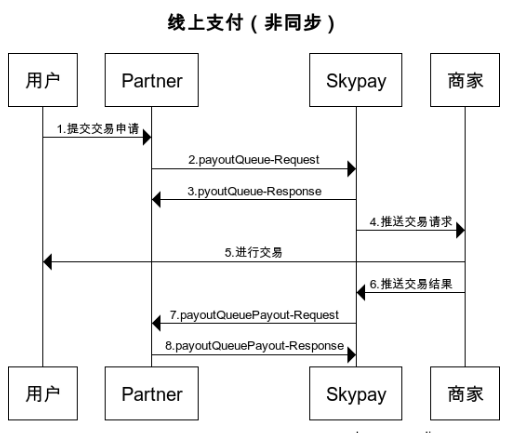

# 推送交易 (银行、钱包)(payoutQueue)
这个API是由SkyPay提供,并由合作伙伴进行主动推送。
当客户取得支付交易核准信息,合作伙伴必须透过此界面推送支付数据进行支付交易。

- 重复支付注意 
    - 为了避免重复支付，重送交易前请先查询交易状态（查询操作请在交易发送后300秒）。
    - 重送不建议更换支付码(避免重复放款，重试间隔应该在300秒以上)。
    - 交易状态是Pending或Complete状态交易记录不可以重送，避免重复支付。
    - 禁止通过不同的提款渠道重新发送同一笔交易。

### Input parameters:
|       参数                | 类型         |   长度       |  Y/N|     描述    |
|:-------------------------:|:-----------:|     :------:     |   :-----:       |-----------|   
|userName |string|50|Y|使用者名称  SkyPay提供 - Ex:"userName":"AppName@skypay"|
|action     |   string  | 50   |  Y  |调用行为 payoutQueuePayout(固定参数值) - Ex:"action":"payoutQueue"|
|authentication|string |50| Y|验证密钥   Ex:"authentication":"E1234567-123C-1234-123F-A12345670"|
|sender  |string|100|  Y  |支付方  产品APP名称(由合作伙伴设计) - Ex:"sender":"APP NAME"|
|controlNumber   | string | 13~15 |  Y |取款码  前缀码5码+8~10个数字（前缀码在绑定邮箱中获取） - Ex:SKY**12345678|
|name |string |50|  Y  |取现人名字 使用逗号分割。  - Last name+","+First name+","+Middle name+","+Suffix - Ex:"name":"Lardizabal,Mary Annalou B.Lardizabal,Berja,|
|phone|string|11 |  Y |09/08开头的11位数字   Ex:"phone":"09270348095"|
|amount|string|10.20  |    Y   |支付金额支持数字小数位两位   ex:"amount":3400.00|
|bankNo|string |50| Y |账户号 银行渠道进行支付时必填，电子钱包无此参数请参考第八章接口8.6 Get Bank Code,银行代码为3位的字符|
|accountNo  |string |50| Y |电子钱包 账号为取现人09/08开头11位长度之手机号码  Bank:取现人指定银行账号,(指定有效之银行账号)|
|withdrawChannel|int||  Y| 指定支付渠道代码  参考第十章管道详细说明[渠道code值](../Paymentpipeline/Paymentpipeline.md)|
|identificationId  |string|        50  |  N       |身份证件号码  依不同身份验证方式,持有证件编号 - Ex:"identificationId":"442301922000"|
|identificationTypeId  |string |3|   N  |验证身份证件类别 参考8.3 Get Identification Type - 银行渠道进行支付时选填，电子钱包无此参数 - Ex:":identificationTypeId":"2"|
|idType  |string|50| N  |验证身份证件类别 电子钱包进行支付时选填，银行无此参数 - ex:"idType":"TIN"|
|idcardPicType  |string|50|     N   |图片格式 电子钱包进行支付时选填，银行无此参数Ex:"idcardPicType":"jpg"|
|idcardPicUrl  |string |500| N  |相片存取网络地址 电子钱包进行支付时选填，银行无此参数Ex:"idcardPicUrl":""|
|birthday  |Date|10|  N     |生日格式 yyyy-MM-dd - Ex:"birthday":"1991-10-02" -  写入此字段，参数需要填入正确格式|
|birthPlace  |string|250|  N  |出生地 银行渠道进行支付时选填，电子钱包无此参数|
|location  |string |500|N |取款人地址  Ex:"location":manila"|
|provinceId |int| |  N   |省份ID 请参考第八章接口8.5 Get Province - 银行渠道进行支付时选填，电子钱包无此参数 - Ex:ProvinceId	Province1	Abra  - 2	Agusan del Norte…|
|cityId  |int||   N   |城巿ID 请参考第八章接口8.4 Get Town City - 银行渠道进行支付时选填，电子钱包无此参数 -  Ex:省份Id城巿Id城巿名称 - ProvinceId TownCityId	TownCity47	996	Manila…|
|expiryDate  |string |50| N|证件到期日 银行渠道进行支付时选填，电子钱包无此参数|

### Post data

### 支付为电子钱包时,调用API送出的数据格式内容:

{ 
    &ensp;&ensp;&ensp;&ensp;"userName" : "AppName@skypay", 
    &ensp;&ensp;&ensp;&ensp;"action" : "payoutQueue", 
    &ensp;&ensp;&ensp;&ensp;"authentication" : "30AC21B2-9EAA-4503-B0F0-7BE5C277ED75", 
    &ensp;&ensp;&ensp;&ensp;"sender" : "app name", 
    &ensp;&ensp;&ensp;&ensp;"controlNumber" : "SK99123456789", 
    &ensp;&ensp;&ensp;&ensp;"name" : "Last name,First name,Middle name", 
    &ensp;&ensp;&ensp;&ensp;"phone" : "092210083333", 
    &ensp;&ensp;&ensp;&ensp;"amount" : "3900.00", 
    &ensp;&ensp;&ensp;&ensp;"accountNo" : "09123456789", 
    &ensp;&ensp;&ensp;&ensp;"withdrawChannel" : "6", 
    &ensp;&ensp;&ensp;&ensp;"identificationId" :  "123456789011"//从这个参数开始都可以传空, 
    &ensp;&ensp;&ensp;&ensp;"idType" :  "SSS", 
    &ensp;&ensp;&ensp;&ensp;"idcardPicType" : "png", 
    &ensp;&ensp;&ensp;&ensp;"idcardPicUrl" : "http://skybridge.com.tw/sample.png", 
    &ensp;&ensp;&ensp;&ensp;"birthday" : "1911-09-01", 
    &ensp;&ensp;&ensp;&ensp;"location" : "1740 Mabini St,Malate,Manila,1004 Metro Manila,Phi-líp-pin" 
}

### 支付为银行时,调用API送出的数据格式内容:（bank交易时，请先走8.6获取银行代码接口来获取目前可用的银行列表） 

{ 
    &ensp;&ensp;&ensp;&ensp;"userName" : "AppName@skypay", 
    &ensp;&ensp;&ensp;&ensp;"action" : "payoutQueue", 
    &ensp;&ensp;&ensp;&ensp;"authentication" : "30AC21B2-9EAA-4503-B0F0-7BE5C277ED75", 
    &ensp;&ensp;&ensp;&ensp;"sender" : "app name", 
    &ensp;&ensp;&ensp;&ensp;"controlNumber" : "SK99123456789", 
    &ensp;&ensp;&ensp;&ensp;"name" : "Last name,First name,Middle name", 
    &ensp;&ensp;&ensp;&ensp;"phone" : "092210083333", 
    &ensp;&ensp;&ensp;&ensp;"amount" : "3900.00", 
    &ensp;&ensp;&ensp;&ensp;"bankNo" : "SEC", 
    &ensp;&ensp;&ensp;&ensp;"accountNo" : "09123456789", 
    &ensp;&ensp;&ensp;&ensp;"withdrawChannel" : "6", 
    &ensp;&ensp;&ensp;&ensp;"identificationId" : "123456789011"//从这个参数开始都可以传空, 
    &ensp;&ensp;&ensp;&ensp;"identificationTypeId" : "1", 
    &ensp;&ensp;&ensp;&ensp;"birthday" : "1911-09-01", 
    &ensp;&ensp;&ensp;&ensp;"birthPlace" : "Manila", 
    &ensp;&ensp;&ensp;&ensp;"location" : "1740 Mabini St,Malate,Manila,1004 Metro Manila,Phi-líp-pin", 
    &ensp;&ensp;&ensp;&ensp;"provinceId" : "996", 
    &ensp;&ensp;&ensp;&ensp;"cityId" : "47", 
    &ensp;&ensp;&ensp;&ensp;"expiryDate" : "2024-05-01" 
}

### Output parameters:

| 参数                        |    类型     | 长度    |描述|
| :-------------------------: | :-----------: |:-----:|--------------------------------|   
|responseTime  |DateTime|50|回传时间  yyyy-MM-dd HH:mm:ss.SSSS|
|responseCode  |int|4|回传代码    1000|
|responseDescription  |string|255|回传内容描述    Success|

### Output data：
{
  &ensp;&ensp;&ensp;&ensp;"responseTime" : "2018-06-18 17:52:10.5211", 
  &ensp;&ensp;&ensp;&ensp;"responseCode" : "1000", 
  &ensp;&ensp;&ensp;&ensp;"responseDescription" : "Success" 
}

### Return code:

| 状态代码                        |   状态描述    | 
| :-------------------------: | :----------- |
|1000|Success|
|-1000|Post context is not valid|
|-1008|Control number is already exists|
|-1009|Unpredictable exception occurMerchant is not available|
|-1016|Insufficient balance|
|-1020|Bank city is incorrect|
|-1021|Bank No is incorrect|
|-1022|Invalid Accountnumber|
|-1027|balance limit exceeded|
|-1028|Has exceeded the limit of 5 transactions per day|
|-1032|Your IP xxx is not whitelisted.Please contact Support Team.|
|-9999|Service not available/Connection error|
|-1001|Invalid Accountnumber|

