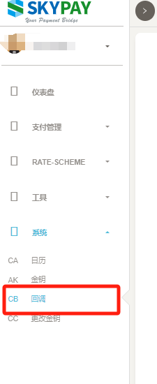
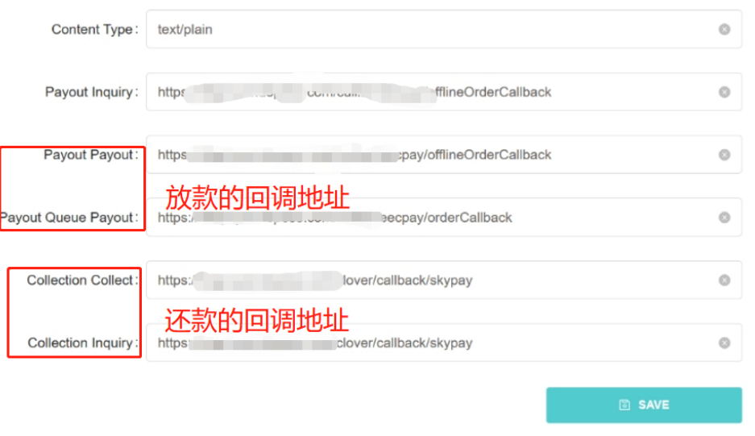
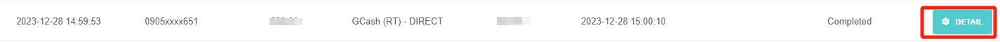
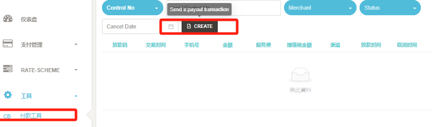
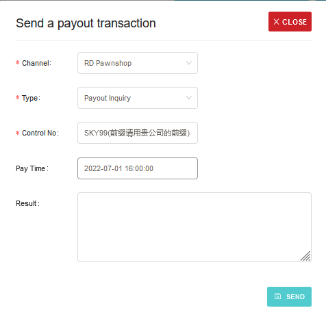

# 6.1 支付测试工具

### 请在后台CallBack配置好对应接口的回调地址，Content Type：text/plain，测试工具位置（中文界面显示付款工具，英文界面显示payout tool）

### 线上渠道放款测试流程
#### 请直接请求3.1 payoutQueue接口，短暂延迟后系统会自动回调3.2 payoutQueuePayout接口通知放款成功。(暂时只能模拟成功回调，不能手动回调或者失败回调)。
#### 接口请求参数及返回的原始信息请点击交易后面的DETAIL按钮

### 线下门店放款测试流程
#### 模拟4.1 payoutInquiry&4.2 payoutPayout线下店支付查询及支付成功回调讯息流程。点击CREATE按钮打开测试工具页面。

### 4.1 payoutInquiry放款查询请求模拟

#### 选择Channel渠道(推荐选择RD Pawnshop)，Type选择payoutInquiry，输入放款码Control No，点击SEND按钮发送请求，此时接口会请求在Callback配置的URL并返回解析过后的信息。
### 4.2 payoutPayout放款确认通知请求模拟
#### 4.1接口成功之后才可以进行4.2操作，单独进行4.2操作会直接失败。选择Channel渠道(推荐选择RD Pawnshop)，Type选择payoutPayout，输入放款码Control No和放款时间Pay Time（EX:2022-07-01 16:00:00），点击SEND按钮发送请求，此时接口会请求在Callback配置的URL并返回解析过后的信息。

