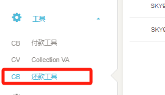
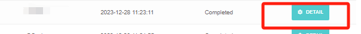
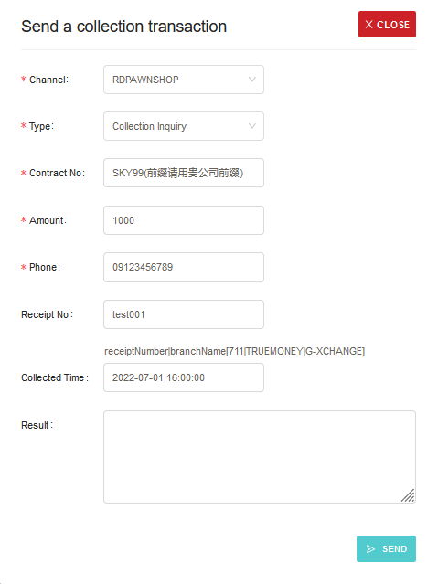

# 7.2 收款测试工具

- 请在后台CallBack配置好对应接口的回调地址，Content Type：text/plain，测试工具位置（中文界面显示还款工具，英文界面显示collection tool）

- 接口请求参数及返回的原始信息请点击交易后面的DETAIL按钮

- 还款测试流程
    - 模拟4.3 Collection Inquiry&4.4 Collection Collect还款查询以及还款确认接口请求。点击CREATE按钮打开测试工具页面。

- 4.3 Collection Inquiry还款查询请求模拟

    - 选择Channel渠道(推荐选择RD Pawnshop)，Type选择Collection Inquiry，输入还款码Contract No，金额Amount和手机号Phone，点击SEND按钮发送请求，此时接口会请求在Callback配置的URL并返回解析过后的信息。

- 4.4 Collection Collect还款确认通知请求模拟

    - 4.3接口成功之后才可以进行4.4操作，单独进行4.4操作会直接失败。选择Channel渠道(推荐选择RD Pawnshop)，Type选择Collection Collect，输入还款码Contract No，金额Amount，手机号Phone(09开头11位纯数字)，收据码Receipt No和还款时间Collected Time(EX:2022-07-01 16:00:00)，点击SEND按钮发送请求，此时接口会请求在Callback配置的URL并返回解析过后的信息。

